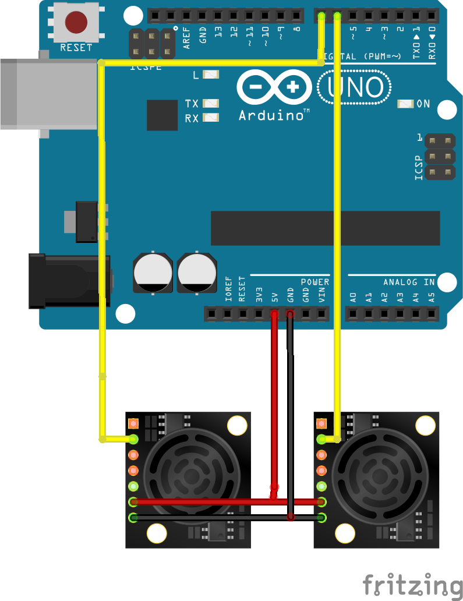

# Atlas-Ultrasonic-Sensor
Here is the code I developed while interning at Atlas Robotics, a robotic forklift startup, for integrating a new set of sensors to their production robot. This repository includes an arduino library to make initializing sensors easier, example arduino code for initalizing two sensors and publishing them into different topics using rosserial, a ROS node for reading and optimising sensor data, and a launch file for launching rosserial and the optimisation node at the same time. 

# Prerequisites 
ROS: [http://wiki.ros.org/ROS/Installation](http://wiki.ros.org/ROS/Installation)

Rosserial:[http://wiki.ros.org/rosserial](http://wiki.ros.org/rosserial)

MegaunıLink Arduino Library for exponantial filtering: [https://www.megunolink.com/documentation/arduino-library/](https://www.megunolink.com/documentation/arduino-library/)

# Installation
```
git clone https://github.com/Canersoz02/Atlas-Sensor.git
```

# Sensor schematics
In this project two Maxsonar EZ1 ultrasonic distance sensors were used however you can easily add more sensors or switch to another distance sensor with a few alterations in the arduino code. 



# Arduino Sensor Library
This library makes it easier to initialize and read data from sensors. 
Creating new sensor objects with given pins:
``` 
#include <Sensor.h>
Sensor sens1(7);
Sensor sens2(6);
```
Reading data from sensors:
```
float data1 = sens1.retValue();
float data2 = sens2.retValue();
delay(20);
```
You can look at the multipleSensor.ino files for example codes to publish data from two sensor into seperate ros topics. multipleSensor1.ino uses 2 maxsonar sensors, multipleSensor2.ino uses one park and one infrared sensor and multipleSensorFiltered.ino uses 2 maxsonar sensors and filters the results using an exponential filter. 

# sensorOptimise.py
Sensor optimise is the main code in this project and it utilizes various methods to optimise sensor data read from ros topics. This optimisation was especially necessary in this project since the maxsonar sensors gave unreliable data under 15cm and it was critical for the robot to detect objects/people nearby. 

The code includes different methods for optimising the data in different ways by using 5 consecutive data readings. The user can select whichever method tp use by changing the "lowest" method with their selected one.
```
a.pub.publish(lowest(arr))
```
Each of the methods will be evaluated below:

### avg():
