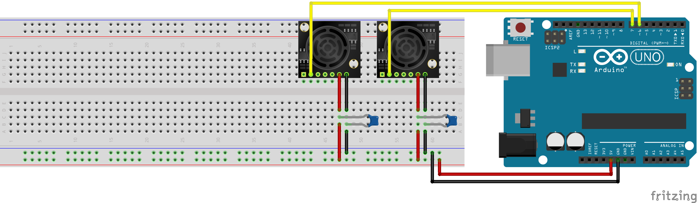

# Atlas-Ultrasonic-Sensor
This repository includes an arduino library to make initializing sensors easier, example arduino code for initalizing two sensors and publishing them into different topics using rosserial, a ROS node for reading and optimising sensor data, and a launch file for launching rosserial and the optimisation node at the same time. 

# Prerequisites 
ROS: [http://wiki.ros.org/ROS/Installation](http://wiki.ros.org/ROS/Installation)

Rosserial:[http://wiki.ros.org/rosserial](http://wiki.ros.org/rosserial)

MegaunıLink Arduino Library for exponantial filtering: [https://www.megunolink.com/documentation/arduino-library/](https://www.megunolink.com/documentation/arduino-library/)

# Installation
```
mkdir -p ~/catkin_ws/src
cd ~/catkin_ws/
catkin_make
git clone https://github.com/Canersoz02/Atlas-Sensor.git
```
### Important 
Move the Sensor file into your arduino libraries to be able to use it as a standard arduino library. 

# Sensor schematics
In this project two Maxsonar EZ1 ultrasonic distance sensors were used however you can easily add more sensors or switch to another distance sensor with a few alterations in the arduino code. 



# Arduino Sensor Library
This library makes it easier to initialize and read data from sensors. 
Creating new sensor objects with given pins:
``` 
#include <Sensor.h>
Sensor sens1(7);
Sensor sens2(6);
```
Reading data from sensors:
```
float data1 = sens1.retValue();
float data2 = sens2.retValue();
delay(20);
```
You can look at the multipleSensor.ino files for example codes to publish data from two sensor into seperate ros topics. multipleSensor1.ino uses 2 maxsonar sensors, multipleSensor2.ino uses one park and one infrared sensor and multipleSensorFiltered.ino uses 2 maxsonar sensors and filters the results using an exponential filter. 

# sensorOptimise.py
Sensor optimise is the main code in this project and it utilizes various methods to optimise sensor data read from ros topics. This optimisation was especially necessary in this project since the maxsonar sensors gave unreliable data under 15cm and it was critical for the robot to detect objects/people nearby. 

The code includes different methods for optimising the data in different ways by using 5 consecutive data readings. The user can select whichever method tp use by changing the "lowest" method with their selected one.
```
a.pub.publish(lowest(arr))
```
Each of the methods will be evaluated below:

### avg()
The average method simply returns the average of the given array. Although it is good at estimating the distance when the datas are close to each other, it isn't very reliable when the object is too close to the sensor since the sensors reading fluctaute from 12 to 640 instantly. 

### setdDev()
This method tries to determine when the object is below 15cm by looking at the standard deviation of the given array. Since the values fluctuate a lot when the object is too close, the method reurns 0 when the standard deviation is more than 4. This method also optimises data sets that do not fluctuate by using the lowest() method. Although stDev() works well in guessing when the object is below threshold value, it also identifies the robots non uniform movement as below 15 cm since the data also fluctuates. Therefore, this method is not very suitable for real life applications. 

### lowset()
Despite its simplicity lowest() in my opinion is the most suitable sensor for real life applications. It siply takes an array and returns the lowest value in it. I preferred calculating the lowest instead of the median since the sensor never returns a value that is closer than the object really is. Therefore, the smallest value is nearly always the correct one. The only shortcoming of this method is when all of the measurements in the set is wrong.(such as [30, 48, 34, 500] when the real distance was 12.) stdDev can be used in this case however it has other problems as discussed above. Because there will be many sensor on the robot, most probably, one of them will guess the correct value below 15cm. 

### inRange()
This method simply returns true if one of the measurements is below 20cm.

### Important
Most of the methods also assume that an object is closer than 15cm when a sensor returns a value more than 644 since the sensors often return 645 when an object is too close. The user may consider to disable this feature if the robot is going to be used in an open are where 645 can be a common real reading. 

# sensor.launch 
sensor.launch is a launch file to launch the rosserial node with selected port and the optimisation node at the same time. The user can change the port selection from the codes 3rd line by replacing /dev/ttyACM0 with wanted port.
```
<param name="port" value="/dev/ttyACM0"/>
```
